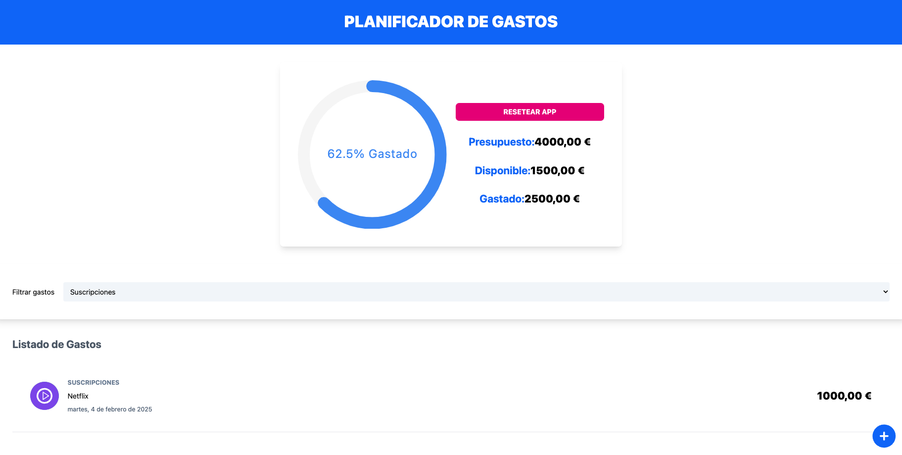

# ExpenseTracker - React, Context API & useReducer

## Descripción
Este proyecto es una aplicación de control de gastos desarrollada con **React**, en la cual he aprendido a manejar distintos componentes, gestionar el estado global con **Context API**, y combinar **useReducer** con **custom hooks** para una mejor organización del estado.

## Tecnologías utilizadas
- **React**: Biblioteca principal para la construcción de la interfaz.
- **Context API**: Para la gestión de estados globales sin necesidad de librerías externas.
- **useReducer**: Para manejar la lógica del estado de forma más estructurada.
- **Custom Hooks**: Para encapsular y reutilizar lógica.
- **React-Date-Picker**: Para la selección de fechas de manera intuitiva.
- **Vite**: Para la configuración y optimización del entorno de desarrollo.

## Lecciones aprendidas
1. **Gestión de estado con Context API y useReducer**:
   - Proporciona una solución eficiente para el manejo de estados globales.
   - Facilita la actualización del estado con una lógica más clara y estructurada.
   
2. **Uso de Custom Hooks**:
   - Permite encapsular lógica reutilizable para mejorar la organización del código.
   - Facilita la separación de responsabilidades en los componentes.
   
3. **Implementación de bibliotecas externas**:
   - Integración de React-Date-Picker para una mejor experiencia de usuario en la selección de fechas.
   - Uso de bibliotecas de NPM para mejorar la funcionalidad de la aplicación.

## Deploy
Puedes ver la aplicación funcionando en el siguiente enlace:  
🔗 [ExpenseTracker Deploy](https://juli-presupuesto.netlify.app)

